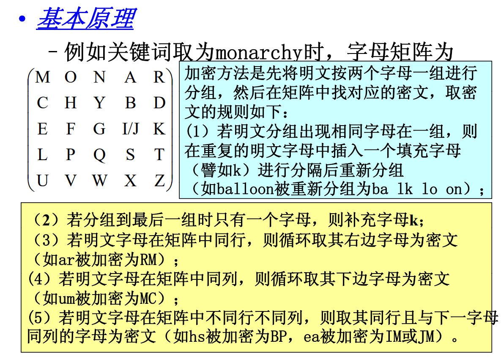

# 信息安全概论

## 信息安全的模型

### 强制访问控制(MAC)的含义？ 

- 概念：用于保护系统确定的对象，对此对象用户不能进行更改。对数据和用户按照安全等级划分标签，访问控制机制通过比较俺去那标签来确定授予还是拒绝用户对资源的访问。

### 多级安全模型

#### 1. BLP机密性模型

- 等级： 公开、受限、秘密(Confidential)、机密(Secret)、高密
- 上读下写，不可读高级数据，不可写低级数据，保证保密性

#### 2. BIBA完整性模型

- 下读上写，不可读低级数据，不可写高级数据，保证完整性

### 多边安全模型

#### 1. Lattice

#### 2. Chinese Wall

### 信息安全管理标准

- GB 17895-1999 《计算机信息系统安全保护等级划分准则》

------

## 防火墙

1. 防火墙应该按照题目描述的顺序
2. 常用端口telnet: 23，smtp: 25, http: 80, https: 443
3. 最后一条规则拒绝双向所有

------

## 对称加密算法

### 古典密码算法

#### 1. 凯撒（固定offset，十分弱智）

#### 2. Playfair

- 不足、重复填充k
- 对角取同行且与下一个字母同列
- 同行取右，同列取下

#### 3. Vigenere 

- 循环使用密钥作为vector offset明文

#### 4.Hill

#### 5. DES

- 密钥长度56位，每轮使用48位异或，共16轮次加密

### 公开密钥算法（非对称加密）

- 安全性：大数的因式分解

#### 1. RSA

- 速度：比DES慢很多就是了

#### 2. ECC

#### 3. ELGamal

------

## 数字签名与身份认证

### 报文鉴别

- 报文鉴别码：用某个密钥生成小数据块追加在报文尾部
- 报文加密：完整的报文的密文作为鉴别码
- 报文摘要：将报文输入单向hash函数得到固定长度的输出作为报文摘要

### 散列函数

散列函数的基本性质：

1. 广泛使用性：适用于任何大小的数据分组
2. 码长固定性：不同输入产生定长输出
3. 易计算性：计算过程消耗资源少
4. 单向不可逆性：无法倒推
5. 弱单向性：给定X无法算出Y使得H(X)=H(Y)
6. 强单向性：找不出(X, Y)对使得H(X)=H(Y)

#### 1. MD5 

- 128位输出 
- 512位分组 划分为16个32位子分组
- 将输入的填充到512N+448位，最后尾部加上64位表示原来长度

#### 2. SHA & SHA-1 

- 160位输出 

### 数字签名

#### 1. RSA数字签名

- 使用算法：RSA + HASH 

#### 2. 离散对数数字签名

- ElGamal、DSS(DSA)

#### 3. 安全性

- 公钥算法基于背包问题、离散对数、因子分解

#### 4. 数字签名的作用

- 不可抵赖性

### 身份认证技术

1. IC卡静态数据不安全就是了
2. 动态口令，同步不便，口令长用户体验差

#### 1. Kerberos

- KDC中的AS和TGS共享数据

1. 客户从KDC中AS处申请并获得初始凭据
2. 客户将初始凭据发送到KDC中TGS，获取会话密钥
3. 客户使用得到的会话密钥与要访问的服务器进行连接

#### 2. X.509认证协议 

- 由可信CA将每个用户的公钥与个人的身份数据签成电子证书

#### 3. CA认证架构

总结：PKI证明用户是谁，PMI证明这个用户由什么权限

##### 3.1 公钥基础设施PKI

- 组成：CA、数字证书库、密钥备份及恢复系统、证书作废系统、应用接口API

##### 3.2 授权管理基础设施PMI

